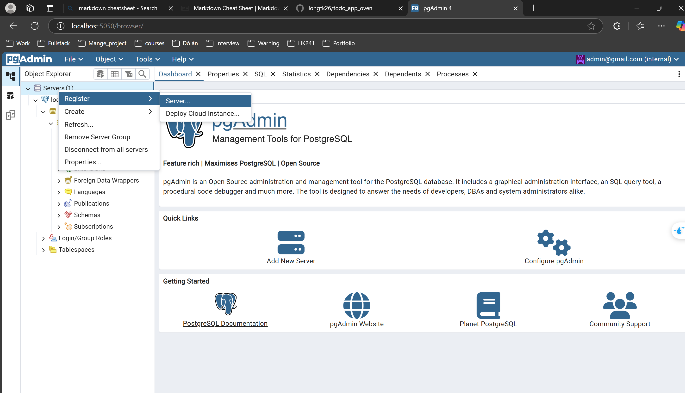
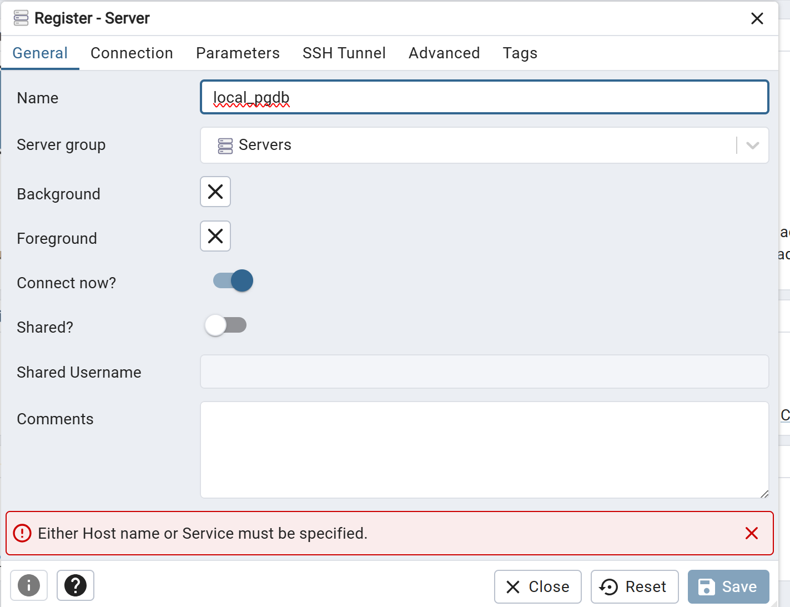
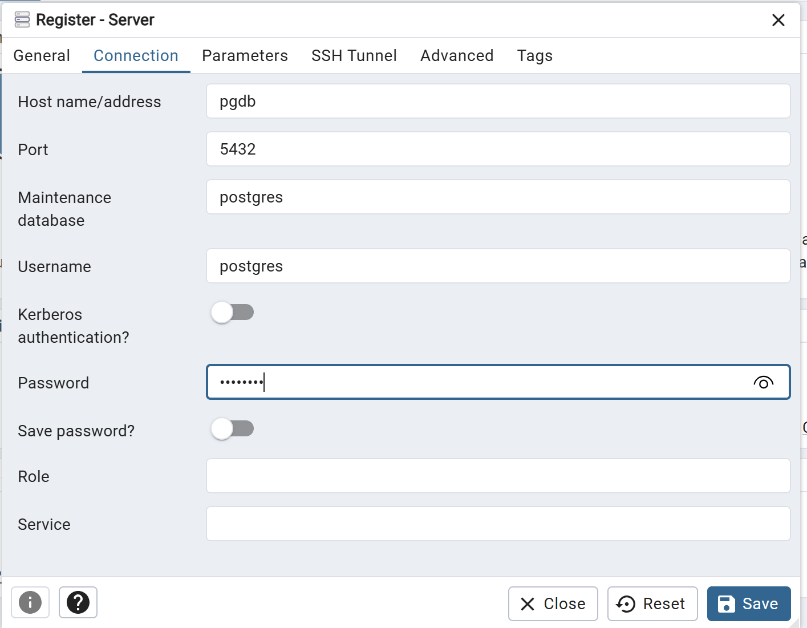
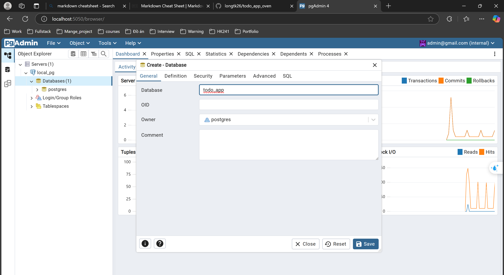

# TODO APP 🏢

## 📖 About the Project
The **TODO App** helps users manage their daily tasks efficiently. 
### Features:
1. User registration and login.
2. Create tasks.
3. Set deadlines and task details.
4. Email verification.
5. Email reminders before a task starts and before it ends.

---

## ⚙️ Prerequisites
Ensure the following dependencies are installed:
- **Docker**: `version 28.0.1` 🐋
- **Node.js**: `version 23.6.1` 🇯‌🇸‌
- **Make**: `version 4.3`

---

## 🤔 How to Run

### 1️⃣ Clone the Repository
```sh
git clone https://github.com/longtk26/todo_app_oven.git
```

### 2️⃣ Navigate to the Project Directory
```sh
cd todo_app_oven
```

### 3️⃣ Install Dependencies
```sh
npm i --legacy-peer-deps
```

### 4️⃣ Start Essential Services with Docker
```sh
docker compose -f docker-compose-dev.yml up -d
```

### 5️⃣ Prepare the `.env` File
- Fill in the necessary information based on `.ex.env`.

### 6️⃣ Prepare the Database
#### Access pgAdmin:
- Open: `http://localhost:5050`
- **Username**: `admin@gmail.com`
- **Password**: `admin`

#### Register a Server:


#### Fill in the Name and Connection Details:



📌 Since all services run in containers, set the database **host** to the container name to enable pgAdmin to find and connect to the PostgreSQL database. Username and password details are in `docker-compose-dev.yml`.

#### Create the `todo_app` Database:


- You can rename the database, but ensure the name is updated in the `.env` file.

#### Run Database Migrations:
```sh
make migrateup
```

### 7️⃣ Run the Application
```sh
npm start
```
- The application will be available at `http://localhost:<port>`.
- To run the app inside a Docker container, refer to **Step 8**.

### 8️⃣ Run the Application in a Docker Container (Optional)
After setting up essential services (`docker-compose-dev.yml`), preparing the `.env` file, and configuring the database, run:
```sh
docker compose -f docker-compose.yml up --build
```

---

## 📜 API Documentation
Visit `http://localhost:<port>/api` to view the OpenAPI (Swagger) documentation.

---

Enjoy managing your tasks with **TODO APP**! ✅